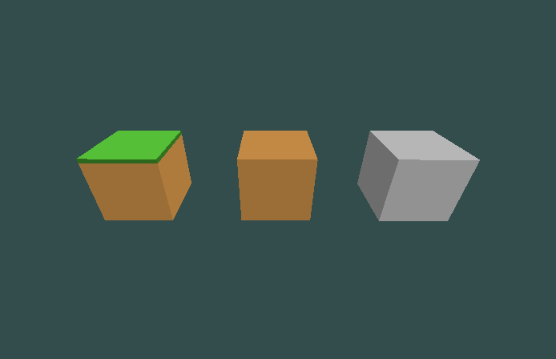
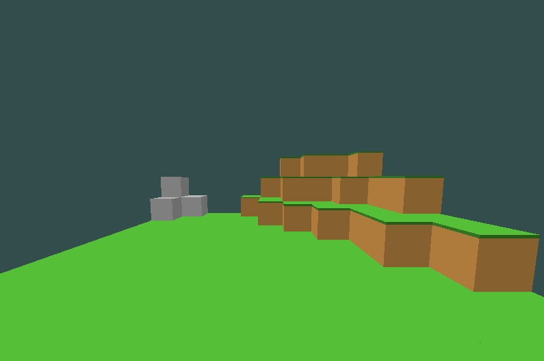

# OpenGL Voxel Engine
An object-oriented engine template used to render voxels using OpenGL

**Feature List:**
<ul>
  <li>Customizable FOV, input sensitivity, movement speed, etc.</li>
  <li>Easy addition of new voxel types</li>
  <li>Editable textures via texture atlas</li>
  <li>Distinct textures for each side of the voxel</li>
</ul>

**Examples:**

Default available textures
 

World example
 

**Disclaimer:** 
The engine does *not* implement everything needed to create a voxel world. The engine does not implement the optimizations necessary (such as chunk management, instancing, or occlusion culling) since they are dependent on the implementation of the world builder, which is not in the template.
